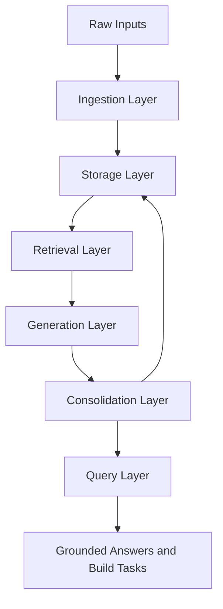

# KOS - High Level Architecture

## One sentence

The Personal Knowledge Operating System is an AI-powered, retrieval-backed learning system that converts raw learning material into structured, cumulative, and reusable knowledge.

## Core idea

Traditional note-taking is fragile because it depends on manual capture, manual organization, and manual recall. This system replaces that workflow with a structured knowledge pipeline. It takes in learning material, applies personal context, extracts the important ideas, connects those ideas to prior knowledge, identifies gaps, and stores the result in a queryable long-term memory layer.

This is not just an AI note-taker. It is a personal knowledge infrastructure layer.

## Problem being solved

Most learning systems fail at continuity. Information gets stored in disconnected notes, documents, bookmarks, chat histories, and course folders. The result is repeated relearning, weak retrieval, and poor translation from learning to implementation.

KOS solves that by making learning cumulative:

- New material is processed against prior knowledge.
- Concepts are connected to existing systems.
- Knowledge gaps are recorded instead of ignored.
- Outputs are stored as structured objects, not loose summaries.
- The system becomes more valuable as it accumulates context.

## System behavior

When new material is added, KOS should:

1. Ingest the source material.
2. Normalize it into clean text.
3. Retrieve relevant personal, technical, and architectural context.
4. Generate a structured synthesis.
5. Extract key concepts and relationships.
6. Identify gaps and implementation opportunities.
7. Store the result in a durable, searchable knowledge base.
8. Make the knowledge retrievable for later questions and builds.

## Inputs

Primary input types:

- Course transcripts
- Technical documentation
- Research papers
- Architecture documents
- Neuropsych and cognitive profile notes
- Linguistic analysis notes
- Personal implementation notes
- Future voice memo transcripts

## Outputs

Each source should eventually produce structured objects such as:

- Dense summary
- Key concepts
- Why it matters
- Links to prior knowledge
- Links to active projects
- Open questions
- Implementation ideas
- Follow-up tasks

## Logical architecture



## Architecture layers

### 1. Ingestion layer

Purpose: turn raw files into clean, processable text.

Responsibilities:

- Load files
- Normalize text
- Assign metadata
- Version documents
- Chunk documents

### 2. Storage layer

Purpose: preserve raw material, metadata, embeddings, and structured outputs.

Storage types:

- Raw file storage
- PostgreSQL relational tables
- pgvector embeddings

### 3. Retrieval layer

Purpose: retrieve the right context before generation.

Context sources:

- Profile documents
- Architecture documents
- Prior summaries
- Concept history
- Related source chunks

### 4. Generation layer

Purpose: convert retrieved context plus source material into structured knowledge.

The output should be dense, precise, and implementation-oriented. It should not produce generic notes.

### 5. Consolidation layer

Purpose: write generated outputs back into long-term memory.

Stores:

- Summaries
- Concepts
- Open questions
- Tasks
- Embeddings
- Relationships

### 6. Query layer

Purpose: let the user ask questions across accumulated knowledge.

Example queries:

- What do I know about retrievers?
- What parts of LangGraph are still weak?
- Show all concepts linked to orchestration.
- What implementation ideas emerged from RAG lessons?

## Business value

The system improves learning efficiency, retention, and decision quality by reducing manual note-taking and making prior knowledge reusable. Its value compounds because every processed source becomes part of the retrievable system context.

## Strategic shift

The key shift is from passive information consumption to active knowledge construction.

Instead of accumulating information, KOS creates a persistent internal knowledge base that becomes more useful over time.

## Claude Code operating context

Use this note as the high-level product and system brief. Claude Code should treat this as the conceptual source of truth for the KOS project.

### Build priorities

- Favor simple local MVP first.
- Store structured knowledge entries, not just summaries.
- Keep source material, derived summaries, concepts, tasks, and prompt logs separate.
- Preserve traceability from generated output back to source documents.
- Avoid overbuilding UI before ingestion, retrieval, and storage work.

### Suggested repo path

```text
personal-knowledge-os/
```

### First implementation objective

Build the minimal pipeline that can:

1. Ingest a transcript or Markdown file.
2. Chunk it.
3. Embed chunks.
4. Retrieve relevant profile and architecture context.
5. Generate a structured knowledge entry.
6. Store the output in PostgreSQL.
7. Query stored entries later.

## Related notes

- [[KOS - Technical Design Document]]
- [[KOS - Build Spec and Implementation Plan]]
- [[KOS Project Index]]
- [[AI Agents]]
- [[RAG]]
- [[PostgreSQL]]
- [[Personal Operating System]]
