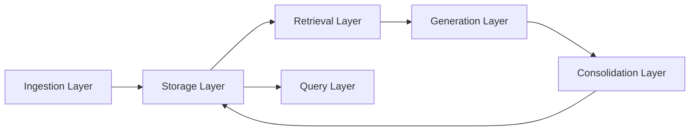

# KOS - Technical Design Document

## Overview

The Personal Knowledge Operating System is a retrieval-augmented learning infrastructure designed to transform raw educational content into structured, reusable knowledge aligned with system-building goals.

Traditional learning workflows depend on manual note-taking. That creates bottlenecks in comprehension, retention, retrieval, and application. KOS replaces manual summarization with a RAG-based pipeline that ingests raw inputs, injects user-specific context, and produces structured knowledge objects stored in a long-term retrieval system.

## Objectives

### Primary objectives

- Eliminate manual note-taking as a bottleneck.
- Convert raw learning inputs into structured knowledge.
- Enable semantic retrieval across prior learning.
- Align learning outputs with system-building goals.

### Secondary objectives

- Track knowledge gaps and unresolved questions.
- Generate implementation-oriented insights.
- Build a reusable system applicable across AI, finance, math, and technical systems.

## Scope

### Supported input types

- Course transcripts
- Technical documentation
- Research papers
- User-authored architecture notes
- User-authored summaries
- Cognitive profile documents
- Linguistic analysis documents
- Markdown notes from Obsidian

### Output artifacts

- Structured knowledge entries
- Concept definitions and mappings
- Open questions
- Knowledge gaps
- Implementation tasks
- Cross-document connections

## System architecture

## Core layers

### 1. Ingestion layer

Responsibilities:

- Load files from `.txt`, `.pdf`, `.md`, and `.docx`.
- Clean and normalize text.
- Assign metadata.
- Chunk documents into retrieval units.

### 2. Storage layer

Hybrid storage model:

- PostgreSQL for relational metadata and structured knowledge objects.
- pgvector for embeddings.
- Local or S3 storage for raw source files.

### 3. Retrieval layer

Retrieval sources:

- Profile documents
- Architecture documents
- Prior knowledge entries
- Document chunks

Retrieval methods:

- Semantic similarity
- Metadata filtering
- Keyword matching
- Weighted reranking

### 4. Generation layer

Responsibilities:

- Extract key concepts.
- Generate concise technical summaries.
- Map concepts to system-level applications.
- Identify knowledge gaps.
- Propose implementation actions.

Outputs should be schema-validated JSON.

### 5. Consolidation layer

Responsibilities:

- Store structured knowledge entries.
- Extract and normalize concepts.
- Map relationships between concepts.
- Store embeddings for future retrieval.
- Track open questions and tasks.

### 6. Query layer

Query examples:

- What do I know about RAG?
- How does LangGraph fit into my architecture?
- What do I not understand about retrievers?
- What implementation tasks are tied to vector databases?

## Data model

Core entities:

| Entity | Purpose |
|---|---|
| `documents` | Raw input metadata and versioning |
| `document_chunks` | Chunked text plus embeddings |
| `knowledge_entries` | Main structured knowledge object |
| `concepts` | Canonical concept layer |
| `concept_relationships` | Links between concepts |
| `open_questions` | Knowledge gaps and unresolved issues |
| `implementation_tasks` | Actions derived from learning |
| `retrieval_logs` | Retrieval observability |
| `prompt_runs` | Prompt versioning and debugging |

## Pipeline design

### Profile ingestion pipeline

Processes persistent user-specific context:

- Neuropsych profile
- Linguistic analysis
- System architecture notes
- Learning preferences
- Personal implementation context

These documents should be heavily weighted during retrieval.

### Learning material ingestion pipeline

Steps:

1. Extract text.
2. Clean text.
3. Chunk content.
4. Embed chunks.
5. Store documents and chunks.

### Retrieval-augmented synthesis pipeline

Steps:

1. Select source chunks.
2. Retrieve profile context.
3. Retrieve prior knowledge.
4. Construct RAG context.
5. Generate structured output.
6. Validate output schema.
7. Persist knowledge entry and related entities.

### Concept consolidation pipeline

Responsibilities:

- Deduplicate concepts.
- Update concept metadata.
- Identify concept relationships.
- Link knowledge entries to concepts.

### Query pipeline

Steps:

1. Classify query type.
2. Retrieve relevant knowledge entries and chunks.
3. Retrieve related concepts and open questions.
4. Generate grounded response.
5. Log retrieval activity.

## Retrieval strategy

Use hybrid retrieval, not pure vector search.

### Retrieval components

- Semantic retrieval for meaning.
- Metadata filtering for scope.
- Keyword matching for exact terms.
- Weighted reranking for relevance.

### Priority order

1. Profile documents
2. Architecture documents
3. Prior knowledge entries
4. Source document chunks

## Prompt design principles

Prompts should:

- Enforce structured JSON output.
- Prioritize system-level understanding.
- Avoid generic summarization.
- Incorporate user-specific context.
- Link learning to implementation.
- Identify unresolved questions.

## Technology stack

### Core stack

- Python
- PostgreSQL
- pgvector
- OpenAI API or comparable LLM API
- Local Markdown vault through Obsidian

### Optional extensions

- FastAPI for API layer
- AWS S3 for raw file storage
- LangGraph for orchestration
- Redis for caching
- Streamlit or React for UI

## MVP definition

The MVP includes:

1. Ingest transcript files.
2. Embed and store chunks.
3. Retrieve profile and prior knowledge context.
4. Generate structured knowledge entries.
5. Store outputs in PostgreSQL.
6. Enable semantic query over stored knowledge.

## Design tradeoffs

### Structured outputs vs free-form summaries

Structured outputs were chosen because they support:

- Consistent storage
- Queryability
- Concept extraction
- Task generation
- Evaluation

### PostgreSQL + pgvector vs external vector DB

PostgreSQL + pgvector was chosen for:

- Simplicity
- Strong relational integration
- Clean local MVP path
- Strong data engineering signaling

### Hybrid retrieval vs pure semantic search

Hybrid retrieval improves:

- Precision
- Exact technical term matching
- Personalization
- Context control

## Evaluation metrics

### Retrieval quality

- Relevance of retrieved chunks
- Coverage of relevant concepts
- Reduced irrelevant context

### Output quality

- JSON validity
- Concept accuracy
- Implementation usefulness
- Low hallucination rate

### Learning efficiency

- Reduction in manual note-taking time
- Ability to recall prior learning
- Ability to connect concepts across domains

## Claude Code operating context

Use this document as the technical specification for the first KOS repo.

### Implementation constraints

- Start with CLI scripts before building UI.
- Use PostgreSQL and pgvector locally.
- Keep ingestion, retrieval, generation, and consolidation separate.
- Use typed schemas for generated outputs.
- Log prompt runs early.
- Keep raw documents traceable to generated knowledge entries.

### Acceptance criteria for MVP

The MVP is complete when:

- A `.txt` or `.md` source can be ingested.
- The system stores document metadata.
- The system chunks and embeds content.
- The system retrieves relevant profile or architecture context.
- The system generates a valid structured knowledge entry.
- The system stores the generated entry.
- The system can answer a query using stored entries and chunks.

## Related notes

- [[KOS - High Level Architecture]]
- [[KOS - Build Spec and Implementation Plan]]
- [[PostgreSQL]]
- [[pgvector]]
- [[RAG]]
- [[Hybrid Retrieval]]
- [[Prompt Engineering]]
